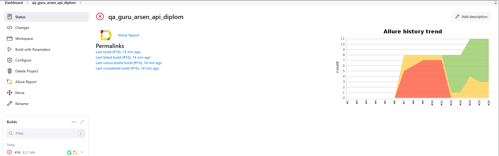
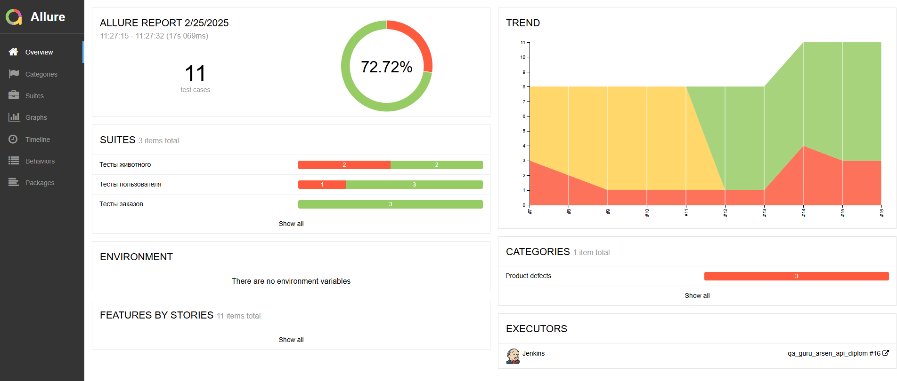
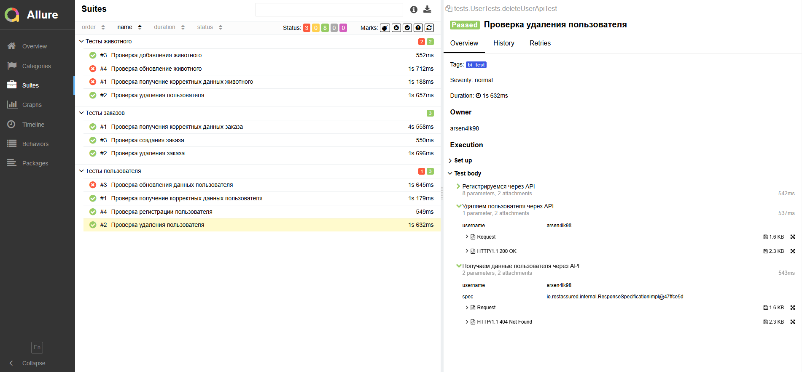
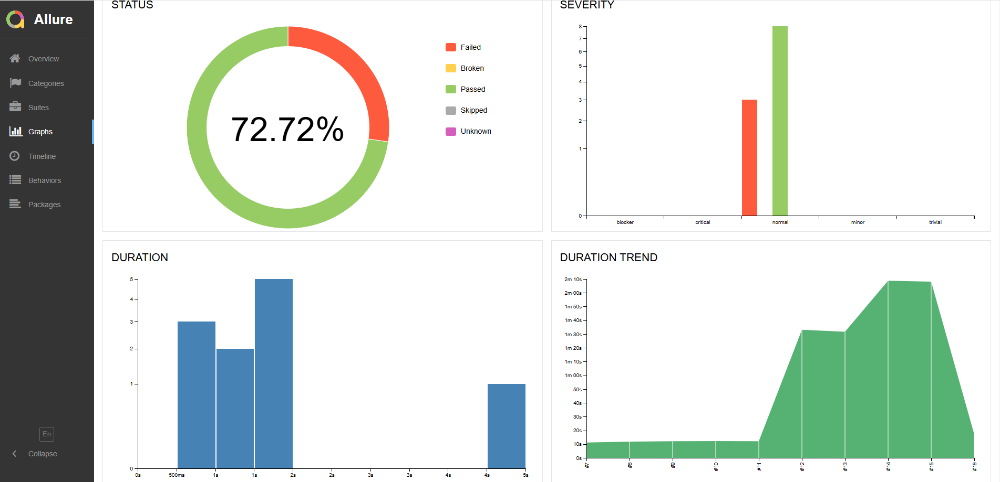
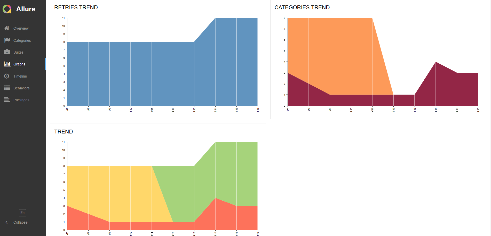
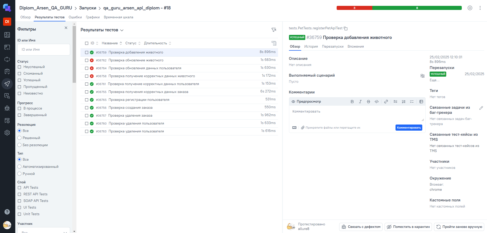
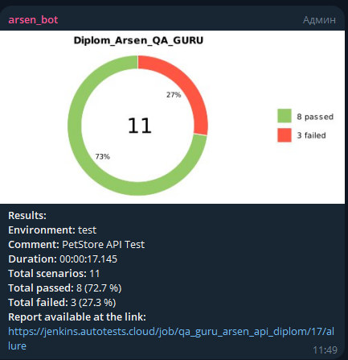

# Проект по автоматизации тестирования для сервиса [PetStore](https://petstore.swagger.io/)

## **Содержание:**
____

* <a href="#tools">Технологии и инструменты</a>

* <a href="#cases">Примеры автоматизированных тест-кейсов</a>

* <a href="#jenkins">Сборка в Jenkins</a>

* <a href="#console">Запуск из терминала</a>

* <a href="#allure">Allure отчет</a>

* <a href="#testops">Интеграция с Allure TestOps</a>

* <a href="#telegram">Уведомление в Telegram при помощи бота</a>

____
<a id="tools"></a>
## <a name="Технологии и инструменты">**Технологии и инструменты:**</a>

<p align="center">  
<a href="https://www.jetbrains.com/idea/"></a>  
<a href="https://www.java.com/"></a>  
<a href="https://github.com/"></a>  
<a href="https://junit.org/junit5/"></a>  
<a href="https://gradle.org/"></a>  
<a href="https://selenide.org/"></a>  
<a href="https://aerokube.com/selenoid/"></a>  
<a href="ht[images](images)tps://github.com/allure-framework/allure2"></a>
<a href="https://www.jenkins.io/"></a>  
<a href="https://www.atlassian.com/ru/software/jira/"></a>  
</p>

____
<a id="cases"></a>
## <a name="Примеры автоматизированных тест-кейсов">**Примеры автоматизированных тест-кейсов:**</a>
____
- ✓ *Проверка регистрации пользователя*
- ✓ *Проверка обновления данных пользователя*
- ✓ *Проверка получение корректных данных пользователя*
- ✓ *Проверка удаления пользователя*
- ✓ *Проверка создания заказа*
- ✓ *Проверка получения корректных данных заказа*
- ✓ *Проверка удаления заказа*
- ✓ *Проверка обновление животного*
- ✓ *Проверка добавления животного*
- ✓ *Проверка получение корректных данных животного*
- ✓ *Проверка удаления животного*


____
<a id="jenkins"></a>
## </a><a name="Сборка"></a>Сборка в [Jenkins](https://jenkins.autotests.cloud/job/qa_guru_arsen_api_diplom/)</a>
____
<p align="center">  
<a href="https://jenkins.autotests.cloud/job/qa_guru_hw14_arsen/"></a>  
</p>


### **Параметры сборки в Jenkins:**

- *browser (браузер, по умолчанию chrome)*
- *browserVersion (версия браузера, по умолчанию 114.0)*
- *browserSize (размер окна браузера, по умолчанию 1920x1080)*
- *baseUrl (адрес тестируемого веб-сайта)*
- *remoteUrl (логин, пароль и адрес удаленного сервера Selenoid)*
- *userName (логин для тестирования)*
- *password (пароль для тестирования)*

<a id="console"></a>
## Команды для запуска из терминала
___
***Локальный запуск:***
```bash  
gradle clean bi_test
```

***Удалённый запуск через Jenkins:***
```bash  
clean
bi_test
-DuserName=${userName}
-Dpassword=${password}
-Dbrowser=${browser}
-DbrowserSize=${browserSize}
-DremoteUrl=https://user1:1234@${remoteUrl}/wd/hub
-DbrowserVersion=${browserVersion}
-Denv=remote
```
___
<a id="allure"></a>
## </a> <a name="Allure"></a>Allure [отчет](https://jenkins.autotests.cloud/job/qa_guru_arsen_api_diplom/18/allure/)</a>
___

### *Основная страница отчёта*

<p align="center">  
  
</p>  

### *Тест-кейсы*

<p align="center">  
  
</p>

### *Графики*

  <p align="center">  


  
</p>

____
<a id="testops"></a>
## </a> Интеграция с </a>Allure [TestOps](https://allure.autotests.cloud/launch/44833)</a>
____
### *Allure TestOps Запуски*
<p align="center">  

</p>

____
<a id="telegram"></a>
## </a> Уведомление в Telegram при помощи бота
____

<p align="center">  
  
</p>
